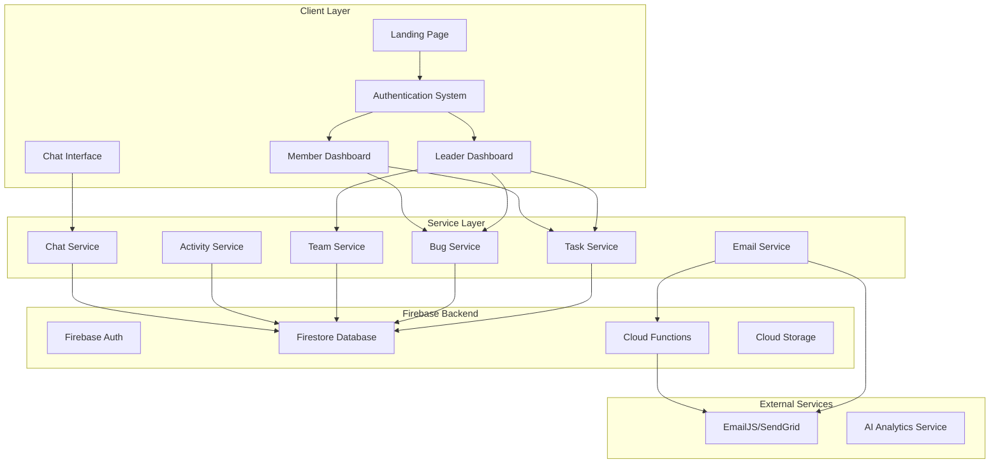

# Design Document: TaskHive Completion

## Overview

TaskHive is a comprehensive project management system built on Firebase that enables teams to collaborate through task management, bug tracking, and real-time communication. This design extends the existing system with enhanced authentication flows, role-specific dashboards, email integration, activity logging, and advanced analytics to create a production-ready platform.

The system follows a client-server architecture with React frontend and Firebase backend, supporting two primary user roles: Leaders (team administrators) and Members (task executors). The design prioritizes real-time synchronization, responsive user experience, and comprehensive audit trails.

## Architecture

### System Architecture



### Data Flow Architecture

The system implements a unidirectional data flow pattern with real-time synchronization:

1. **User Actions** → Service Layer → Firebase Backend
2. **Real-time Updates** → Firebase Listeners → Service Layer → UI Components
3. **Email Notifications** → Cloud Functions → External Email Service
4. **Activity Logging** → Intercepted at Service Layer → Activity Log Collection

## Components and Interfaces

### Authentication System

**Enhanced Authentication Flow:**
- Unified signup with role selection (Leader/Member)
- Team code validation for members
- Session persistence with role-based routing
- White screen elimination through proper loading states

```typescript
interface AuthenticationService {
  signUp(email: string, password: string, role: UserRole, teamCode?: string): Promise<AuthResult>
  signIn(email: string, password: string): Promise<AuthResult>
  validateTeamCode(code: string): Promise<boolean>
  getCurrentUser(): User | null
  signOut(): Promise<void>
}

interface User {
  uid: string
  email: string
  role: 'leader' | 'member'
  teamId?: string
  displayName?: string
  createdAt: Date
}
```

### Dashboard Components

**Leader Dashboard:**
- Real-time project statistics
- Team member activity overview
- Performance analytics with charts
- Task and bug management interfaces

**Member Dashboard:**
- Personal task view (assigned tasks only)
- Task status updates
- Progress tracking
- Bug reporting interface
- Notifications panel

```typescript
interface DashboardService {
  getLeaderStats(teamId: string): Promise<LeaderStats>
  getMemberTasks(userId: string): Promise<Task[]>
  updateTaskStatus(taskId: string, status: TaskStatus): Promise<void>
  getActivityFeed(teamId: string, limit?: number): Promise<Activity[]>
}

interface LeaderStats {
  totalTasks: number
  completedTasks: number
  activeBugs: number
  teamMembers: number
  completionRate: number
  weeklyProgress: ProgressData[]
}
```

### Email Integration System

**Email Service Implementation:**
- Integration with EmailJS or Firebase Functions + SendGrid
- Template-based email system
- Delivery tracking and error handling
- Queue management for bulk operations

```typescript
interface EmailService {
  sendTeamInvitation(email: string, teamCode: string, teamName: string): Promise<EmailResult>
  sendTaskAssignment(email: string, task: Task): Promise<EmailResult>
  sendBugNotification(email: string, bug: Bug): Promise<EmailResult>
  sendWeeklyDigest(email: string, summary: WeeklySummary): Promise<EmailResult>
}

interface EmailTemplate {
  id: string
  subject: string
  htmlContent: string
  textContent: string
  variables: Record<string, any>
}
```

### Activity Logging System

**Comprehensive Activity Tracking:**
- Automatic logging of all system actions
- Searchable and filterable activity history
- Real-time activity feeds
- Audit trail for compliance

```typescript
interface ActivityService {
  logActivity(activity: ActivityData): Promise<void>
  getActivities(teamId: string, filters?: ActivityFilters): Promise<Activity[]>
  getActivityFeed(teamId: string, realTime: boolean): Observable<Activity[]>
}

interface Activity {
  id: string
  teamId: string
  userId: string
  userName: string
  action: ActivityType
  entityType: 'task' | 'bug' | 'team' | 'user'
  entityId: string
  details: Record<string, any>
  timestamp: Date
}

type ActivityType = 'created' | 'updated' | 'deleted' | 'assigned' | 'completed' | 'joined' | 'left'
```

### Real-time Chat System

**Team Communication Platform:**
- Real-time messaging with Firebase Realtime Database
- Team-based message channels
- Message history and search
- Online presence indicators

```typescript
interface ChatService {
  sendMessage(teamId: string, message: MessageData): Promise<void>
  getMessages(teamId: string, limit?: number): Promise<Message[]>
  subscribeToMessages(teamId: string): Observable<Message[]>
  updatePresence(userId: string, status: PresenceStatus): Promise<void>
}

interface Message {
  id: string
  teamId: string
  userId: string
  userName: string
  content: string
  timestamp: Date
  edited?: boolean
  editedAt?: Date
}
```

## Data Models

### Enhanced User Model

```typescript
interface User {
  uid: string
  email: string
  displayName: string
  role: 'leader' | 'member'
  teamId?: string
  avatar?: string
  preferences: UserPreferences
  lastActive: Date
  createdAt: Date
  updatedAt: Date
}

interface UserPreferences {
  emailNotifications: boolean
  pushNotifications: boolean
  theme: 'light' | 'dark'
  language: string
}
```

### Enhanced Task Model

```typescript
interface Task {
  id: string
  title: string
  description: string
  status: 'todo' | 'in_progress' | 'done'
  priority: 'low' | 'medium' | 'high' | 'urgent'
  assignedTo?: string
  assignedBy: string
  teamId: string
  dueDate?: Date
  estimatedHours?: number
  actualHours?: number
  tags: string[]
  attachments: Attachment[]
  comments: Comment[]
  createdAt: Date
  updatedAt: Date
}
```

### Enhanced Bug Model

```typescript
interface Bug {
  id: string
  title: string
  description: string
  severity: 'low' | 'medium' | 'high' | 'critical'
  status: 'open' | 'in_progress' | 'resolved' | 'closed'
  reportedBy: string
  assignedTo?: string
  teamId: string
  stepsToReproduce: string[]
  expectedBehavior: string
  actualBehavior: string
  environment: string
  attachments: Attachment[]
  resolution?: string
  createdAt: Date
  updatedAt: Date
  resolvedAt?: Date
}
```

### Team Model Extensions

```typescript
interface Team {
  id: string
  name: string
  description: string
  code: string
  leaderId: string
  members: TeamMember[]
  settings: TeamSettings
  createdAt: Date
  updatedAt: Date
}

interface TeamMember {
  userId: string
  email: string
  displayName: string
  role: 'leader' | 'member'
  joinedAt: Date
  lastActive: Date
  permissions: Permission[]
}

interface TeamSettings {
  allowMemberInvites: boolean
  requireApprovalForTasks: boolean
  emailNotifications: boolean
  chatEnabled: boolean
  maxMembers: number
}
```

### Analytics Data Models

```typescript
interface ProjectAnalytics {
  teamId: string
  period: 'daily' | 'weekly' | 'monthly'
  metrics: AnalyticsMetrics
  trends: TrendData[]
  insights: AIInsight[]
  generatedAt: Date
}

interface AnalyticsMetrics {
  taskCompletionRate: number
  averageTaskTime: number
  bugResolutionTime: number
  teamVelocity: number
  memberProductivity: MemberProductivity[]
}

interface AIInsight {
  type: 'performance' | 'bottleneck' | 'recommendation'
  title: string
  description: string
  confidence: number
  actionable: boolean
  suggestedActions: string[]
}
```

## Correctness Properties

*A property is a characteristic or behavior that should hold true across all valid executions of a system—essentially, a formal statement about what the system should do. Properties serve as the bridge between human-readable specifications and machine-verifiable correctness guarantees.*

Based on the prework analysis, the following properties ensure system correctness across all valid inputs and scenarios:

### Authentication and Navigation Properties

**Property 1: Navigation redirects are role-appropriate**
*For any* successful authentication, the system should redirect users to dashboards that match their assigned role (leader → leader dashboard, member → member dashboard)
**Validates: Requirements 2.4**

**Property 2: Team code validation is enforced**
*For any* member signup attempt, the system should require team code input and validate it before allowing registration
**Validates: Requirements 2.2**

**Property 3: Invalid team codes trigger error messages**
*For any* invalid team code input, the system should display descriptive error messages and prevent signup completion
**Validates: Requirements 2.3**

**Property 4: Session persistence across page refresh**
*For any* authenticated user, page refresh should maintain their session state and display appropriate content without requiring re-authentication
**Validates: Requirements 2.6**

### Task Management Properties

**Property 5: Task filtering by assignment**
*For any* authenticated member, the dashboard should display only tasks that are specifically assigned to that member
**Validates: Requirements 3.1**

**Property 6: Task status updates persist**
*For any* task status change by a member, the system should persist the change to the database and update the display to reflect the new status
**Validates: Requirements 3.2**

**Property 7: Progress metrics accuracy**
*For any* member dashboard access, the system should calculate and display accurate personal progress metrics based on their assigned tasks
**Validates: Requirements 3.4**

**Property 8: Notification relevance filtering**
*For any* member, displayed notifications should only include items relevant to their assigned tasks and team activities
**Validates: Requirements 3.6**

### Email Integration Properties

**Property 9: Team invitation emails contain codes**
*For any* team member invitation by a leader, the email service should send an email containing the correct team code
**Validates: Requirements 4.1**

**Property 10: Task assignment notifications**
*For any* task assignment to a member, the email service should send a notification email to the assigned user
**Validates: Requirements 4.2**

**Property 11: Bug lifecycle notifications**
*For any* bug report or resolution event, the email service should notify relevant team members
**Validates: Requirements 4.3**

**Property 12: Email failure handling**
*For any* email delivery failure, the system should handle the error gracefully and provide appropriate user feedback
**Validates: Requirements 4.5**

### Analytics and Dashboard Properties

**Property 13: Real-time statistics accuracy**
*For any* leader dashboard access, the system should display accurate real-time project statistics including current task completion rates
**Validates: Requirements 5.1**

**Property 14: Member activity overview display**
*For any* leader accessing their dashboard, the system should show comprehensive member activity overviews for their team
**Validates: Requirements 5.2**

**Property 15: Performance analytics generation**
*For any* team with sufficient data, the system should generate performance analytics with charts and progress indicators
**Validates: Requirements 5.3**

**Property 16: Real-time metric updates**
*For any* project data change, dashboard metrics should update in real-time to reflect the current state
**Validates: Requirements 5.4**

**Property 17: Productivity trend calculation**
*For any* team, the system should calculate and display accurate productivity trends and milestone tracking
**Validates: Requirements 5.5**

### Activity Logging Properties

**Property 18: Task lifecycle logging**
*For any* task creation, assignment, or completion event, the activity log should record the event with accurate timestamps and details
**Validates: Requirements 6.1**

**Property 19: Bug lifecycle logging**
*For any* bug report or resolution event, the activity log should capture comprehensive activity details
**Validates: Requirements 6.2**

**Property 20: Membership change logging**
*For any* team member join or leave event, the activity log should record the membership change with appropriate details
**Validates: Requirements 6.3**

**Property 21: Activity search and filtering**
*For any* activity search or filter operation, the system should return accurate results matching the specified criteria
**Validates: Requirements 6.4**

**Property 22: Activity log integrity**
*For any* attempt to modify activity log entries, the system should prevent unauthorized changes and maintain data integrity
**Validates: Requirements 6.5**

### Chat System Properties

**Property 23: Team-bounded messaging**
*For any* message sent through the chat system, it should only be delivered to members of the same team
**Validates: Requirements 7.1**

**Property 24: Real-time message delivery**
*For any* message sent to online team members, the chat system should deliver it instantly
**Validates: Requirements 7.2**

**Property 25: Message history accessibility**
*For any* team member, the system should maintain and provide access to complete message history for their team
**Validates: Requirements 7.3**

**Property 26: Offline message storage**
*For any* message sent while users are offline, the chat system should store the message for later retrieval when they come online
**Validates: Requirements 7.4**

**Property 27: Team-based access control**
*For any* message channel, access should be restricted to members of the appropriate team with proper access control enforcement
**Validates: Requirements 7.5**

### User Experience Properties

**Property 28: Loading indicator display**
*For any* data loading operation, the system should display appropriate loading indicators during the process
**Validates: Requirements 8.2**

**Property 29: Error message clarity**
*For any* system error, the system should provide clear error messages and recovery options to users
**Validates: Requirements 8.3**

**Property 30: Context preservation during navigation**
*For any* navigation event, the system should preserve user context and session state
**Validates: Requirements 8.5**

### Advanced Analytics Properties

**Property 31: AI insights generation**
*For any* team with advanced features enabled, the system should generate AI-powered project insights
**Validates: Requirements 9.1**

**Property 32: Performance pattern analysis**
*For any* team, the system should analyze performance patterns and generate optimization suggestions
**Validates: Requirements 9.2**

**Property 33: Deadline alert generation**
*For any* task with approaching deadlines, the system should provide proactive alerts and recommendations
**Validates: Requirements 9.3**

**Property 34: Performance metrics calculation**
*For any* team, the system should generate accurate performance metrics including velocity and completion trends
**Validates: Requirements 9.4**

**Property 35: Predictive analytics provision**
*For any* applicable project, the system should offer predictive analytics for timeline estimation
**Validates: Requirements 9.5**

### Data Synchronization Properties

**Property 36: Cross-client synchronization**
*For any* data change, the system should synchronize updates across all connected clients in real-time
**Validates: Requirements 10.1**

**Property 37: Data persistence reliability**
*For any* user operation, the system should reliably persist data using Firebase backend services
**Validates: Requirements 10.2**

**Property 38: Offline change synchronization**
*For any* offline changes made by users, the system should synchronize them when network connectivity is restored
**Validates: Requirements 10.3**

**Property 39: Concurrent operation consistency**
*For any* concurrent user operations on the same data, the system should maintain data consistency
**Validates: Requirements 10.4**

**Property 40: Error recovery and data integrity**
*For any* system error, the system should preserve data integrity and provide recovery mechanisms
**Validates: Requirements 10.5**

## Error Handling

### Authentication Errors
- **Invalid Credentials**: Display clear error messages for incorrect email/password combinations
- **Team Code Validation**: Provide specific feedback for invalid or expired team codes
- **Session Expiry**: Gracefully handle session timeouts with automatic re-authentication prompts
- **Network Connectivity**: Handle offline scenarios with appropriate user feedback and retry mechanisms

### Data Operation Errors
- **Firebase Connection Issues**: Implement retry logic with exponential backoff for database operations
- **Concurrent Modification**: Handle optimistic locking conflicts with user-friendly resolution options
- **Data Validation**: Provide immediate feedback for invalid input data with specific error descriptions
- **Permission Errors**: Clear messaging when users attempt unauthorized operations

### Email Service Errors
- **Delivery Failures**: Log failed email attempts and provide alternative notification methods
- **Rate Limiting**: Handle email service rate limits with queuing and retry mechanisms
- **Template Errors**: Validate email templates and provide fallback content for rendering failures
- **Configuration Issues**: Graceful degradation when email services are unavailable

### Real-time Communication Errors
- **Connection Drops**: Automatic reconnection for chat and real-time updates with user notification
- **Message Delivery Failures**: Retry mechanisms for failed message delivery with user feedback
- **Presence Updates**: Handle presence system failures without affecting core functionality
- **Bandwidth Issues**: Optimize real-time updates for low-bandwidth scenarios

### UI/UX Error Handling
- **Loading States**: Prevent white screens with skeleton loaders and progress indicators
- **Navigation Errors**: Fallback routes and error boundaries to prevent application crashes
- **Component Failures**: Graceful degradation of non-critical UI components
- **Browser Compatibility**: Feature detection and polyfills for older browsers

## Testing Strategy

### Dual Testing Approach

The TaskHive system requires comprehensive testing through both unit tests and property-based tests to ensure correctness and reliability:

**Unit Tests**: Focus on specific examples, edge cases, and integration points
- Authentication flow testing with specific user scenarios
- UI component testing with mock data
- Service integration testing with Firebase
- Error condition testing with simulated failures
- Edge case validation for boundary conditions

**Property-Based Tests**: Verify universal properties across all inputs
- Generate random user data, tasks, and team configurations
- Test system behavior across wide input ranges
- Validate data consistency under concurrent operations
- Verify real-time synchronization properties
- Test email and notification systems with varied scenarios

### Property-Based Testing Configuration

**Testing Framework**: Use `fast-check` for JavaScript/TypeScript property-based testing
- Minimum 100 iterations per property test to ensure comprehensive coverage
- Each property test must reference its corresponding design document property
- Tag format: **Feature: taskhive-completion, Property {number}: {property_text}**

**Test Categories**:

1. **Authentication Properties** (Properties 1-4)
   - Test role-based redirects with random user roles and authentication states
   - Validate team code requirements across various signup scenarios
   - Verify session persistence through simulated page refreshes

2. **Task Management Properties** (Properties 5-8)
   - Generate random task assignments and verify filtering accuracy
   - Test status updates with various task states and user permissions
   - Validate progress metrics calculation with diverse task distributions

3. **Email Integration Properties** (Properties 9-12)
   - Test email sending with random team invitations and task assignments
   - Simulate email delivery failures and verify error handling
   - Validate notification targeting with various team configurations

4. **Analytics Properties** (Properties 13-17)
   - Generate random project data and verify statistics accuracy
   - Test real-time updates with concurrent data modifications
   - Validate trend calculations across different time periods

5. **Activity Logging Properties** (Properties 18-22)
   - Test comprehensive logging across all system operations
   - Verify search and filtering with random query parameters
   - Validate data integrity under various access scenarios

6. **Chat System Properties** (Properties 23-27)
   - Test message delivery with random team configurations
   - Verify access control across different user permissions
   - Test offline/online scenarios with message persistence

7. **Data Synchronization Properties** (Properties 36-40)
   - Test real-time synchronization with concurrent user operations
   - Verify offline change synchronization with network simulation
   - Validate data consistency under error conditions

### Integration Testing Strategy

**Firebase Integration Tests**:
- Test authentication flows with actual Firebase Auth
- Verify Firestore operations with test database instances
- Test Cloud Functions with local emulators
- Validate real-time listeners and data synchronization

**Email Service Integration**:
- Test EmailJS integration with sandbox environments
- Verify template rendering with various data inputs
- Test delivery tracking and error handling
- Validate rate limiting and queue management

**End-to-End Testing**:
- User journey testing from signup to task completion
- Cross-browser compatibility testing
- Mobile responsiveness validation
- Performance testing under load

### Test Data Management

**Test Data Generation**:
- Use property-based testing generators for realistic data
- Create diverse team configurations and user scenarios
- Generate edge cases for boundary condition testing
- Maintain test data isolation between test runs

**Mock Services**:
- Mock external email services for unit testing
- Simulate network conditions for offline testing
- Mock Firebase services for isolated component testing
- Create test doubles for AI analytics services

### Continuous Testing

**Automated Test Execution**:
- Run property-based tests on every code change
- Execute integration tests in CI/CD pipeline
- Perform regression testing for critical user flows
- Monitor test coverage and property validation rates

**Performance Testing**:
- Load testing for concurrent user scenarios
- Real-time synchronization performance validation
- Email service throughput testing
- Database query optimization verification